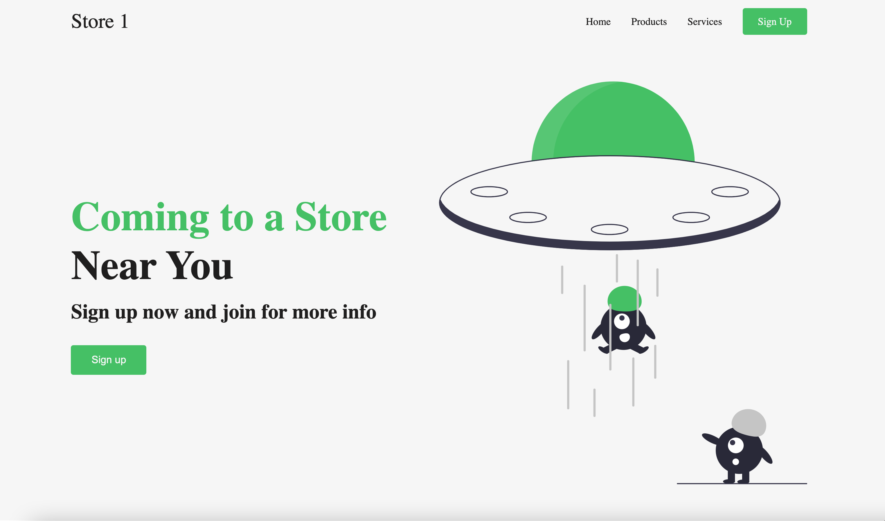

# Responsive Ecommerce 

## Deployed Application:
https://rahmedy.github.io/Responsive-Site/
 
    

## Description
Created a minimal E-commerce site with a clean UI ready for use. The site does not have back-end functionality. This was created for UI purposes to showcase my front-end SCSS skills and to further practice and enhance my ability in development. Please contact me with any inquiries.



## Table of Contents
* [Usage](#usage)
* [Contribution Guidelines](#contribution-guidelines)
* [Tests](#tests)
* [Questions](#questions)

## Use
Ecommerce 
## License
This project is licensed under none license.
## Contribution 
Rayan Ahmedy
## Tests
Run the following command:
``` Start Live Server ```


## Contact 
rayanahmedy1999@gmail.com

## GitHub account:  
https://github.com/@rahmedy
